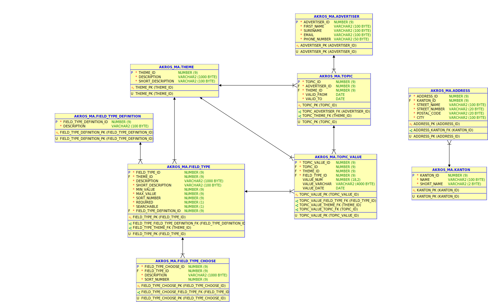

## Database only

- This command runs a preconfigured PostgreSQL database.
- This is primary used for backend developers using a database to test their Rest-Service.

### Database Configuration
- **user** : am
- **passsword** : am
- **database_name** : am
- **host** : localhost
- **port** : 5432

### PostgreSQL Data Files / Reinitialize Database

The data files are stored in sub directory **../pg_data**. This directory is once created on first run and installs the required tables, views and initializes the data. 

To rebuild the database, shut the database down and delete the **../pg_data** directory. On next start the database will be reinitialized again.

The folder **../db_init** is used for initialization of the database.

### Start/Stop
- **start**: docker-compose up
- **stop**: docker-compose down

### Data Model

